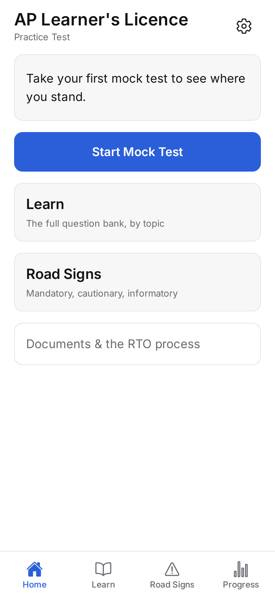
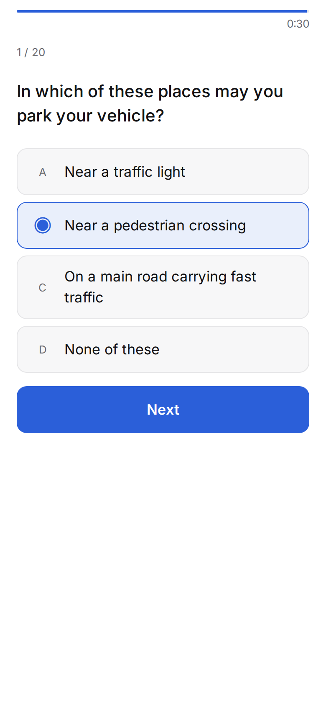
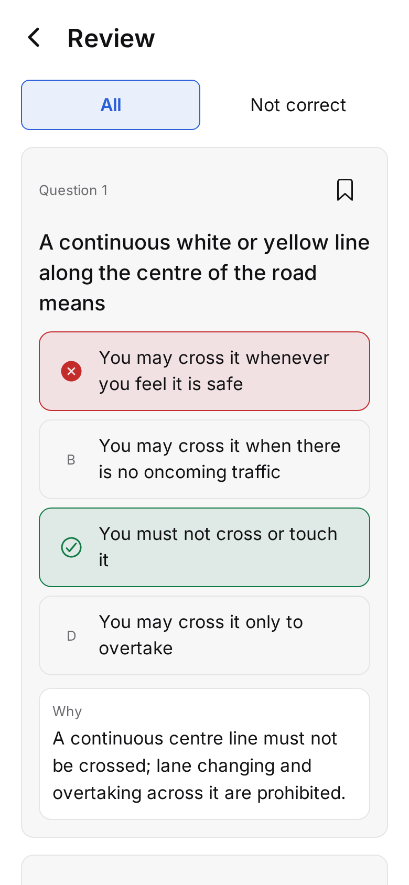
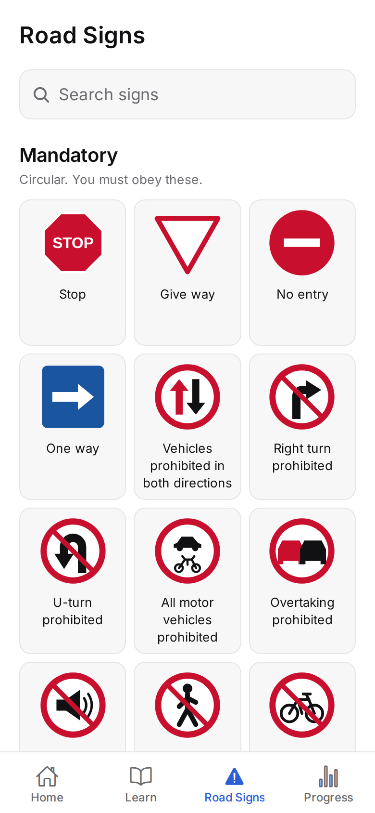

# AP Learner's Licence — Practice Test

An offline practice app for the **Andhra Pradesh Learner's Licence (LLR) computer test**.
v1 is English-only; Telugu (తెలుగు) is v1.1 — see PRD Amendment A1.

> **This is an unofficial study aid.** It is not affiliated with, endorsed by, or
> connected to the Transport Department, Government of Andhra Pradesh, the Ministry of
> Road Transport & Highways, Parivahan, or Sarathi. Questions are derived from the LLR
> question bank published publicly by the AP Transport Department
> (<https://www.aptransport.org/html/llr-question-bank.html>). Always verify current
> rules, fees and test format on the official portal.

No accounts. No ads. No tracking. No network required — ever.

---

## Status

**Phase 0 complete.** The app itself does not exist yet; it is scaffolded at milestone M2.

| Milestone | State |
|---|---|
| Phase 0 — exam-format research, `exam-config.json`, gate `G-CONFIG` | ✅ done |
| M1 — content pipeline built and tested end-to-end | ✅ done |
| M1 — content shippable | ✅ **277 questions, every blocking gate green** (English-only, PRD A1) |
| M2 — app foundation | ✅ code complete; **verified on web only** — device gate pending |
| M3 — mock exam end-to-end | ✅ engine, persistence, session/result/review; **web E2E**; device E2E pending |
| M4 — Learn + Road Signs | ✅ 68 signs redrawn as SVG; topic lists, detail, flashcards, search, signs chart; web E2E |
| M5 — Progress + Guide | ✅ progress tab, weak-area practice, bookmarks, dated documents-and-process guide; web E2E. **Guide values unverified against the live portal** (egress blocked) |

**`src/content/questions.ts` is real, typed, and ready to import.** 277 questions, 91 / 108 / 78
by topic, every answer key valid, IDs stable across re-runs. It typechecks under `strict` +
`noUncheckedIndexedAccess` and is 260 KB.

```
$ npm run content:validate
[PASS] G-STRUCT  G-BILINGUAL  G-TELUGU  G-ASSET  G-DEDUP  G-KEY  G-MERGE  G-MIX  G-IDSTABLE
  TOTAL  277 of 277 ingested    quarantined: 0
✓ all blocking gates passed
```

**Why English-only.** The dataset has zero Telugu, the AP Telugu PDFs are unreachable from the
build environment, and machine translation is forbidden. So v1 invokes the pre-agreed fallback,
recorded as **Amendment A1** at the top of [`docs/01-PRD.md`](docs/01-PRD.md). Language is a
config, not a code path: `src/content/content-config.json` lists `["en"]`; adding `"te"` re-arms
every Telugu gate and widens the `Lang` type in the generated module.

**Two things to know before writing store copy** — both in
[`docs/07-content-assessment.md`](docs/07-content-assessment.md): the bank's rows cite the
*Telangana*-published bank, not `aptransport.org` (§3), and Telangana's department-confirmed
format is a 10-minute whole-paper clock, which contradicts our timing default (§5).

## Running the app

```bash
npm install
npm start            # Expo dev server — press a / i / w, or scan with Expo Go
npm run web          # browser

npm run check        # typecheck + lint + every test suite + every gate
npm run export:web && npm run screenshots   # the screenshot matrix in docs/screenshots/
```

**M2 is verified on the web target only.** The screenshot matrix below is real, but the
implementation plan's M2 gate — Telugu (now: any script) at 100% and 200% text scale on a
physical mid-range Android — needs a device this environment does not have. The line-height
arithmetic that makes 200% work is unit-tested; the rendering is not yet eyeballed on hardware.

| Home | Exam | Review | Road Signs |
|---|---|---|---|
|  |  |  |  |

Every screen × {light, dark} is in `docs/screenshots/` — 30 images plus three sign contact sheets, regenerated by CI on every push.

### The sign set

All 68 road signs the bank references are **redrawn as SVG** by `pipeline/03_draw_signs.py` from a
hand-authored registry (`pipeline/signs.json`) — the bank reached us as text, so nothing could be
extracted. Mandatory, cautionary and informatory sheets: `docs/screenshots/signs-{category}.png`.

```bash
npm run e2e:web      # fresh install → full 20-question mock → result → review → bookmark → resume
```

## What you can run today

```bash
git clone <this repo> && cd app1

npm test                      # gate G-CONFIG + its 22 tests (no install needed)
npm run validate:config       # just the gate, with a readable summary
```

Neither needs `npm install` — both run on Node's built-in test runner against zero
dependencies, so the exam config stays gated even before the app exists.

The content pipeline needs Python:

```bash
python3 -m venv .venv && .venv/bin/pip install -r pipeline/requirements.txt

.venv/bin/python pipeline/test_pipeline.py          # 39 tests, incl. ID stability
npm run content:ingest                              # CSV -> canonical records
npm run content:validate                            # every gate, --strict
npm run content:emit                                # -> src/content/questions.ts
npm run typecheck:content                           # tsc --strict on the generated module
```

`npm test` runs every gate and every suite: G-CONFIG, G-LANG, G-I18N, the 38 zero-dependency
gate tests, 136 node tests (engine, design math, guide content, DB against real SQLite via `node:sqlite`), and the
Jest component tests.

```
$ npm run validate:config
G-CONFIG PASS — 20 questions, 12 to pass (60%), per-question,
  UNVERIFIED (formatVerifiedOn: null — app must say so on the pre-exam screen)
```

## Changing the exam format

Everything about the mock exam lives in **`src/content/exam-config.json`**. Question
count, pass mark, timing model, forward-only navigation, topic mix. Change that file and
the exam changes — there is no code to edit.

```bash
$EDITOR src/content/exam-config.json
npm run validate:config        # fails loudly if the edit is internally inconsistent
```

The current values are **unverified guesses**, and sources disagree — notably on whether
the pass bar is 60% or 80%. `formatVerifiedOn` ships `null`, and while it is null the app
must tell the user the format is unconfirmed. `docs/00-phase0-exam-format.md` §3 is a
ten-item checklist to take to the RTO that resolves every one of them.

## Content pipeline

```bash
pip install -r pipeline/requirements.txt

python3 pipeline/01_download.py            # fetch the six PDFs + SHA-256 manifest
python3 pipeline/01_download.py --offline  # or hash PDFs you placed in pipeline/raw/
```

`--offline` is the escape hatch for networks that block `aptransport.org`: download the
six by hand, drop them in `pipeline/raw/`, and every downstream stage behaves identically.

The stages that exist today read the **consolidated CSV** in `pipeline/raw/supplied/`,
since that is how the bank actually arrived:

```
02_ingest_csv.py  CSV -> canonical records (Telugu recorded as absent, never invented)
05_validate.py    the gates from 02-TRD.md §4; quarantines to reports/needs_review.json
06_emit.py        stable IDs via id-map.json; refuses to emit a monolingual bundle
```

`02_extract.py` (PDF tables) and `04_merge.py` (the Telugu↔English join) are written when
the official PDFs arrive — their design depends on the real table structure, and writing
extraction code against a PDF nobody has opened is how a bank fills with confidently wrong
answers.

## Documentation

| Doc | What it holds |
|---|---|
| [`docs/00-phase0-exam-format.md`](docs/00-phase0-exam-format.md) | **Start here.** Format research, the access blocker, the RTO checklist, the assumptions ledger |
| [`docs/01-PRD.md`](docs/01-PRD.md) | Problem, users, requirements, launch criteria |
| [`docs/02-TRD.md`](docs/02-TRD.md) | Stack, pipeline gates, exam engine, performance budgets |
| [`docs/03-UIUX-Design.md`](docs/03-UIUX-Design.md) | Tokens, typography (**authoritative line-height table**), screens, a11y |
| [`docs/04-App-Flow.md`](docs/04-App-Flow.md) | Navigation, exam state machine, edge cases |
| [`docs/05-Data-Schema.md`](docs/05-Data-Schema.md) | Content schema, SQLite schema, key queries, migrations |
| [`docs/06-Implementation-Plan.md`](docs/06-Implementation-Plan.md) | Milestones, gates, risk register, cut order |
| [`docs/07-content-assessment.md`](docs/07-content-assessment.md) | **What the supplied dataset is and is not.** Five open decisions |
| [`docs/adr-001-stack.md`](docs/adr-001-stack.md) | Why Expo — and what was rejected |

## Repository layout

```
docs/                 the seven specs above
pipeline/             Python content pipeline
  sources.json        the six official PDF URLs
  lib_content.py      normalisation, category->topic map, Telugu ratio, content hash
  signs.json          hand-authored sign registry: id, category, name, meaning, CSV rows
  text-fixes.json     the two wording fixes that remove compilation framing (never keys)
  01_download.py      fetch + SHA-256 manifest (with --offline mode)
  02_ingest_csv.py    consolidated CSV -> canonical records; restores the official sign stem
  03_draw_signs.py    registry -> src/content/signs/*.svg
  05_validate.py      the content gates
  06_emit.py          stable IDs + bundle
  test_pipeline.py    21 tests, incl. the ID-stability property
  id-map.json         content hash -> stable ID. COMMITTED. Never hand-edit
  raw/                source PDFs + supplied/ CSVs — committed for reproducibility
  reports/            validation output, human-review queues
scripts/
  validate-exam-config.mjs   gate G-CONFIG (zero deps)
  validate-content-config.mjs gate G-LANG (zero deps)
  __tests__/                 36 tests across both
src/app/                     expo-router routes (SDK 57 puts them under src/)
  _layout.tsx                fonts → prefs → theme → navigation theme → SQLite → Stack
  (tabs)/                    Home · Learn · Road Signs · Progress
  exam/intro.tsx             rules read live from exam-config.json
  exam/session.tsx           M3
  practice/session.tsx       M5 — the exam reducer, untimed, immediate feedback
  bookmarks.tsx guide/index.tsx   M5
  settings.tsx about.tsx language.tsx
src/components/              AppText, Buttons, Card, Segmented, ScreenHeader, ReadinessCard, PreExamRules…
src/design/                  tokens.ts (exact hex, both themes) · typography.ts · contrast.ts · theme.tsx
src/db/                      schema.ts (DDL verbatim) · migrations.ts · queries.ts · provider.tsx
src/i18n/                    en.json + typed t(); locales derived from content-config.json
src/state/                   prefs (theme, language) — kv-store native, localStorage web, read sync at boot
src/engine/                  the exam engine — pure, no React:
  rng.ts                     seeded PRNG (papers reproducible from attempts.seed)
  selection.ts               sectionMix exactly, no repeats, weak-area weighting
  scoring.ts                 score = correct − wrong×negativeMark, clamped; pass iff ≥ passMark
  timing.ts clock.ts         deadlines; background reconciliation; backwards-clock detection
  session.ts                 the state machine as a reducer returning state + DB effects
src/db/attempts.ts           the paper as a DB fact: create/load/resume/finalise, question_stats
src/test/                    Jest setup + renderWithProviders
src/content/
  guide.json                 documents, fees, process — every item dated (lastVerified), gated by a test
  exam-config.json           the single source of exam-format truth
  exam-config.schema.json    its JSON Schema
  content-config.json        which languages ship (v1: en). Gates and app both read it
  content-config.schema.json its JSON Schema
  questions.ts               GENERATED — 277 typed questions + 68 signs. Never edit; npm run content:emit
  signs/*.svg, signs/index.ts GENERATED — artwork + the SIGN_ART component registry
```

`src/`, `app/` and the Expo project are filled in at M2, per `docs/02-TRD.md` §3.

## Developer notes — SDK 57 things that differ from what you may remember

- Routes live in **`src/app/`**, not `app/`. `Tabs` is `import { Tabs } from 'expo-router/js-tabs'`
  (the root export is deprecated); `Stack`, `Link`, `Redirect` still come from `expo-router`.
- React Native's `Text` now owns a `role` prop (ARIA), so `AppText` calls its typographic role
  **`variant`**.
- TypeScript 6 no longer auto-includes `@types/*` — `tsconfig.json` lists `types: ["node","jest"]`.
- `@testing-library/react-native` 14 renders **asynchronously** under React 19: always
  `await renderWithProviders(...)` and `await fireEvent.press(...)`.
- `npx expo install` needs `api.expo.dev`; where that is blocked, the same pins are local in
  `node_modules/expo/bundledNativeModules.json` — install with plain `npm install pkg@pin`.
- The exam session is a pure reducer (`src/engine/session.ts`), not a store: every transition is a unit test.
- Sign artwork is imported statically through `react-native-svg-transformer` (`metro.config.js`); a missing file fails the bundle. Jest maps `*.svg` to `src/test/svg-mock.tsx`.
- On web, stack screens beneath the current one stay mounted but hidden — E2E locators wait for a `:visible` match.
- Two test runners on purpose: `*.test.ts` (pure logic, `node --test` + real SQLite) and
  `*.test.tsx` (components, Jest + jest-expo). See `docs/adr-001-stack.md`.
- `useColorScheme()` can return `'unspecified'`; treat anything that is not `'dark'` as light.

## Before you build for the stores

Two things gate the timeline and neither is code — start both on day 0:

- **Google Play** — register as an **organization**, not a personal account. Personal
  accounts created after 13 Nov 2023 must run a 14-day closed test with 12 testers before
  they may publish. Organization accounts are exempt. Needs a D-U-N-S number.
- **Apple Developer Program** — enrol immediately; organization enrolments routinely take
  weeks. Also needs the D-U-N-S number.

See `docs/06-Implementation-Plan.md` §0.
