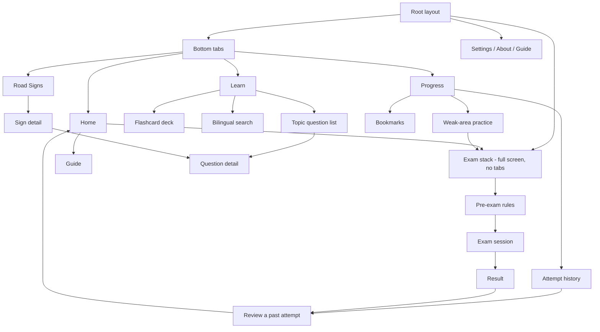
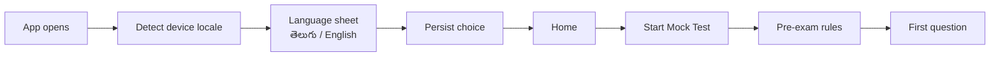
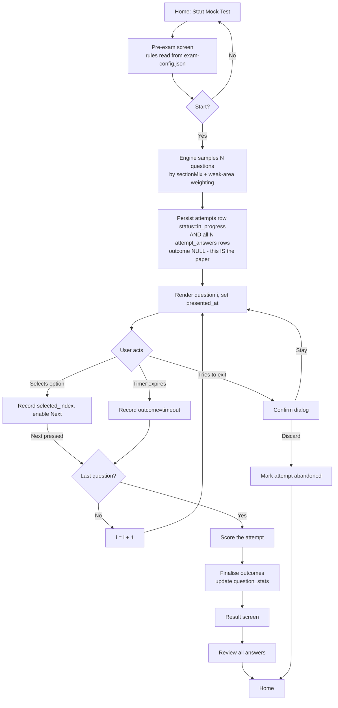
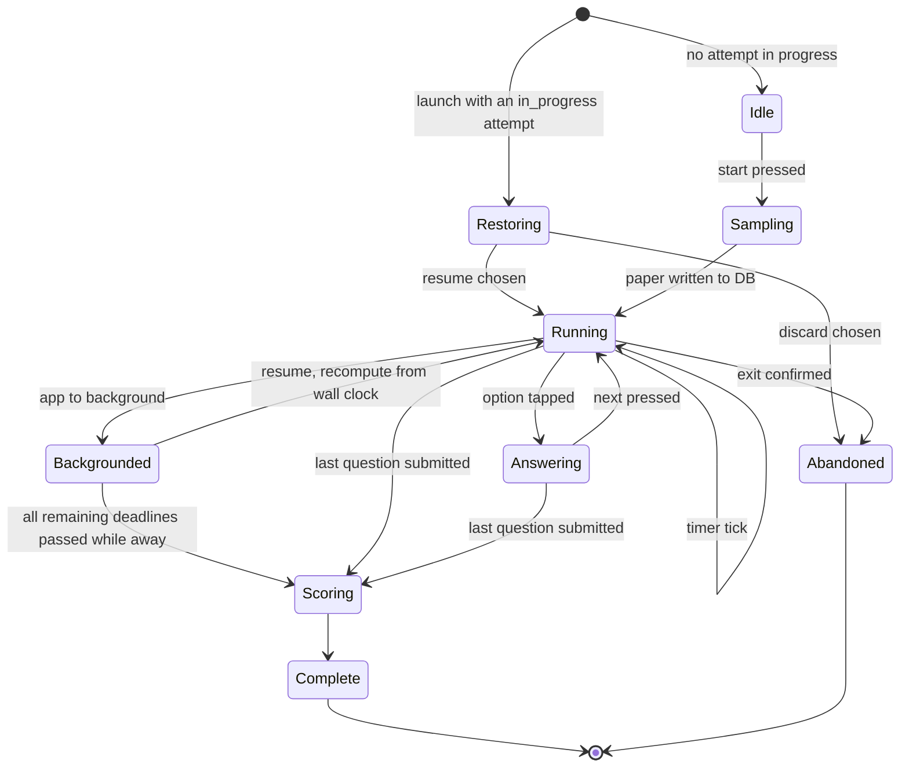
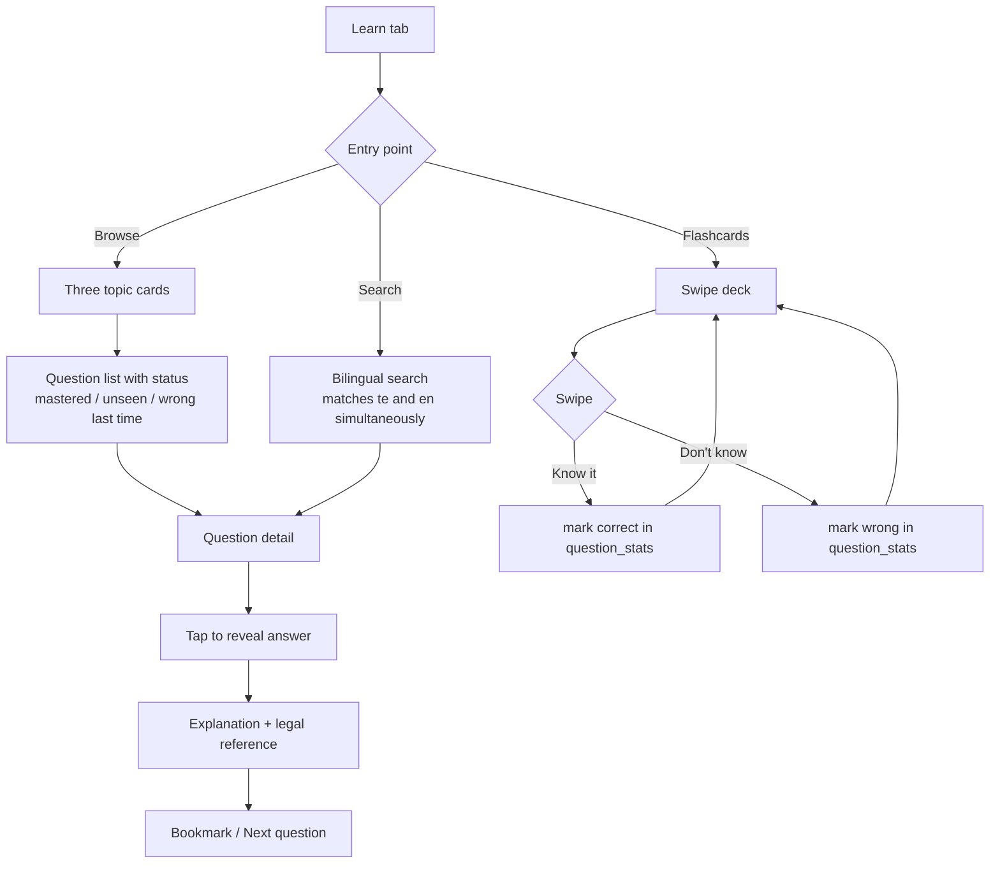
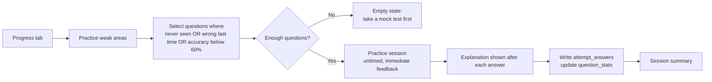
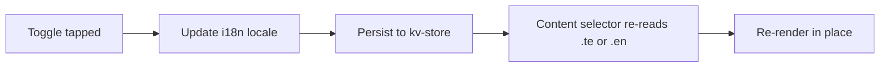

# App Flow — AP Learner's Licence Practice App

**Status:** Draft v2 · **Date:** 21 Sep 2026

---

## 1. Navigation architecture

Four bottom tabs. Everything else is a stack pushed on top, or a full-screen route that hides the tab bar.

**Why four tabs, not five:** Guide, Settings and About are read once or twice in the app's whole lifetime. Giving them a permanent tab would cost a quarter of the navigation bar for near-zero use. They live behind the Home header and a card.

## 2. First launch

The entire path from install to answering a question is three taps and zero network calls.

**No** onboarding carousel, account creation, permission prompt, or network request. If the detected locale is `te`, the sheet pre-selects Telugu — the user just confirms.

## 3. Mock exam flow

### Exam session state machine

**Backgrounding is the subtle one**, and the rule depends on the timing mode:

- **`whole-paper`:** recompute remaining time from `attempts.started_at` against the wall clock. If the paper's time elapsed while away, go straight to scoring.
- **`per-question`** (the shipped default): each question has its own deadline, `presented_at + secondsPerQuestion`. On resume, every question whose deadline passed while backgrounded is recorded in order as `outcome = 'timeout'`, and the session advances to the first question still live. If that consumes the paper, go to scoring.

Never trust accumulated ticks — always recompute from persisted wall-clock timestamps.

**Resume works because the paper is a database fact, not a re-derivation.** All N `attempt_answers` rows are written when the attempt is created, with `outcome` NULL. Re-sampling from `seed` would *not* be safe: it reproduces the same paper only if `question_stats` is unchanged, and any flashcard or practice use between abandoning and resuming mutates exactly that table.

## 4. Learn flow

Flashcard self-assessment writes to `question_stats`, but **only to the all-modes counters** (`seen_count`, `correct_count`, `wrong_count`, `last_seen_at`) — never to `exam_seen` / `exam_correct`. Weak-area sampling reads the exam columns, so "I knew that" on a flashcard shows up in your progress display but cannot fool the engine into thinking you've mastered a question you've never answered under exam conditions. Flashcards create no `attempts` row.

## 5. Weak-area practice

Practice mode differs from the mock exam deliberately: **untimed, immediate feedback, explanation after every question**. The mock exam simulates; practice teaches. Do not merge them.

A practice session **does** create an `attempts` row with `mode = 'practice'` and its own `attempt_answers` rows — that is what the Session summary reads. It sets no `pass_mark` or `passed`, and it never touches `exam_seen` / `exam_correct`, so practice cannot inflate your readiness score. Every per-topic accuracy figure on the Progress screen filters to `mode = 'mock' AND status = 'completed'` for exactly this reason.

## 6. Language switch

Reachable from three places — the Home header, Settings, and the pre-exam screen. (PRD R7 is worded to match: available from those three, locked for the duration of an attempt.) Switching is **instant and total** — question text, options, explanations, sign names and every UI string change together, with no reload and no lost position.

**Blocked during an active exam session.** Switching language mid-paper would change the questions under the user and corrupt the simulation. The toggle is hidden on the session screen; the choice is made on the pre-exam screen and locked for that attempt.

## 7. Edge cases

| Situation | Behaviour |
|---|---|
| App killed mid-exam | On next launch, detect `attempts.status = 'in_progress'`, offer *Resume* or *Discard*. Never silently lose an attempt. |
| Phone call / backgrounding | Timer continues from wall clock. Whole-paper time expired while away → straight to scoring. |
| Device clock changed mid-exam | Detect a backwards jump; fall back to monotonic elapsed time and flag the attempt as untimed rather than scoring it wrongly. |
| No attempts yet | Readiness card shows an invitation, not a zero. Weak-areas card hidden entirely. |
| All questions mastered | Weak-area practice shows a genuine empty state: *"No weak areas right now — take a full mock test."* |
| Search with no results | *"No questions match. Try a shorter word."* — plus a hint that search works in both languages. |
| Quarantined question count changes after an update | Content version shown on About; question IDs are stable so existing stats and bookmarks survive. |
| Bookmark pointing at a removed question | Filtered out at read time, not crashed on. |
| Text scale at 200% | Layouts reflow vertically; nothing truncates; option rows grow. |
| First launch offline | Everything works. There is no online path to fall back from. |

## 8. Deep links

Declare `"scheme": "aplld"` in the app config, then register links that match the actual routes — a mismatch is a silent dead link:

| Link | Route |
|---|---|
| `aplld://question/rrr-014` | `app/question/[id].tsx` |
| `aplld://signs/mandatory-no-entry` | `app/signs/[signId].tsx` |
| `aplld://exam/intro` | `app/exam/intro.tsx` |

All resolve entirely offline. No universal-link domain is needed for v1.
